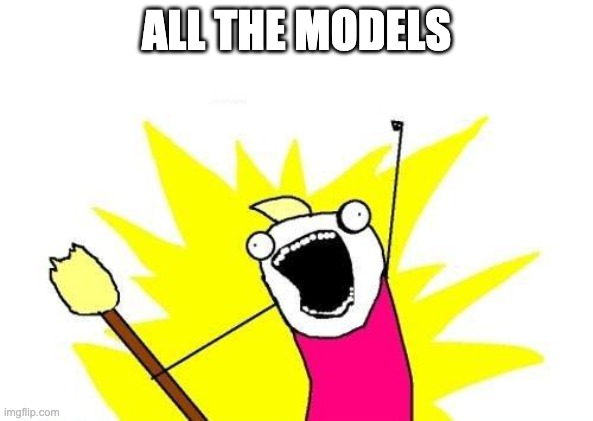

```{r startup, include = FALSE}
library(tidymodels)
tidymodels_prefer()
thm <- theme_bw() + 
  theme(
    panel.background = element_rect(fill = "transparent", colour = NA), 
    plot.background = element_rect(fill = "transparent", colour = NA),
    legend.position = "top",
    legend.background = element_rect(fill = "transparent", colour = NA),
    legend.key = element_rect(fill = "transparent", colour = NA)
  )
theme_set(thm)
source("_common.R")

knitr::opts_chunk$set(
  comment = "#>",
  collapse = TRUE,
  digits = 3, 
  fig.path = "images/models-",
  fig.align = 'center',
  fig.width = 10,
  fig.height = 6,
  out.width = "95%",
  dev = 'svg',
  dev.args = list(bg = "transparent"),
  tidy = FALSE
)
```

class: title-slide, left, middle
background-image: url("images/tidymodels.svg")
background-position: 85% 50%
background-size: 30%
background-color: #F9F8F3

.pull-left[

# `r rmarkdown::metadata$title`

## `r rmarkdown::metadata$author`

### `r rmarkdown::metadata$event`

### Repo: `r slide_url`

]


---
layout: false
class: inverse, middle, center

# [`tidymodels.org`](https://www.tidymodels.org/)

# _Tidy Modeling with R_ ([`tmwr.org`](https://www.tmwr.org/))

---
# Define the score of "The Model" 

In tidymodels, there is the idea that a model-oriented data analysis consists of

 - a preprocessor, and 
 - a model
 
The preprocessor might be a simple formula or a sophisticated recipe.  

It's important to consider both of these activities as part of the data analysis process.

 - Post-model activities should also be included there (e.g. calibration, cut-off optimization, etc.)
 - We don't have those implemented yet. 


---
# Basic tidymodels components

```{r blocks, echo = FALSE, out.width="70%", fig.align='center'}
knitr::include_graphics("images/blocks.png")
```


---
# A relevant example

Let's say that we have some highly correlated predictors and we want to reduce the correlation by first applying principal component analysis to the data. 

 - AKA principal component regression
 
---
# A relevant example

Let's say that we have some highly correlated predictors and we want to reduce the correlation by first applying principal component analysis to the data. 

 - AKA ~~principal component regression~~ feature extraction


---
# A relevant example

Let's say that we have some highly correlated predictors and we want to reduce the correlation by first applying principal component analysis to the data. 

 - AKA ~~principal component regression~~ feature extraction

What do we consider the estimation part of this process? 


---
# Is it this? 

```{r faux-model, echo = FALSE, out.width="70%", fig.align='center'}
knitr::include_graphics("images/faux-model.svg")
```


---
# Or is it this? 

```{r real-model, echo = FALSE, out.width="70%", fig.align='center'}
knitr::include_graphics("images/the-model.svg")
```


---
# What's the difference?

It is easy to think that the model fit is the only estimation steps. 

There are cases where this could go really wrong: 

* Poor estimation of performance (buy treating the PCA parts as known)

* Selection bias in feature selection

* Information leakage

These problems are exacerbated as the preprocessors increase in complexity and/or effectiveness. 

_We'll come back to this at the end of this section_

---
layout: false
class: inverse, middle, center

# Data splitting

---
layout: false
class: inverse, middle, center
background-color: #FFFFFF

# <span style="color:Black;">Always have a separate piece of data that can <span style="color:Red;"><b>contradict</b></span> what you <span style="color:Blue;"><b>believe</b></span></span>


---

# Data splitting and spending

How do we "spend" the data to find an optimal model? 

We _typically_ split data into training and test data sets:

*  ***Training Set***: these data are used to estimate model parameters and to pick the values of the complexity parameter(s) for the model.

*  ***Test Set***: these data can be used to get an independent assessment of model efficacy. **They should not be used during model training** (like, at all). 


---

# Data splitting and spending 

The more data we spend, the better estimates we'll get (provided the data is accurate).  

Given a fixed amount of data:

* Too much spent in training won't allow us to get a good assessment of predictive performance.  We may find a model that fits the training data very well, but is not generalizable (overfitting)

* Too much spent in testing won't allow us to get a good assessment of model parameters

Statistically, the best course of action would be to use all the data for model building and use statistical methods to get good estimates of error.

From a non-statistical perspective, many consumers of complex models emphasize the need for an untouched set of samples to evaluate performance.


---

# Large data sets

When a large amount of data are available, it might seem like a good idea to put a large amount into the training set. _Personally_, I think that this causes more trouble than it is worth due to diminishing returns on performance and the added cost and complexity of the required infrastructure. 

Alternatively, it is probably a better idea to reserve good percentages of the data for specific parts of the modeling process. For example: 

* Save a large chunk of data to perform feature selection prior to model building
* Retain data to calibrate class probabilities or determine a cutoff via an ROC curve. 

Also, there may be little need for iterative resampling of the data. A single holdout (aka validation set) may be sufficient in some cases if the data are large enough and the data sampling mechanism is solid.  


---

# Mechanics of data splitting

There are a few different ways to do the split: simple random sampling, _stratified sampling based on the outcome_, by date, or methods that focus on the distribution of the predictors.

For stratification:

* **classification**: this would mean sampling within the classes to preserve the distribution of the outcome in the training and test sets

* **regression**: determine the quartiles of the data set and sample within those artificial groups

For _time series_, we often use the most recent data as the test set. 

---

# Splitting with NHL data `r I(hexes(c("rsample", "dplyr")))`

`initial_split()` can be used when we use randomness to make the split.

```{r split}
library(tidymodels)
library(ongoal)

tidymodels_prefer()

on_goal <- on_goal %>% filter(season == "20152016") %>% select(-season)

nhl_split <- initial_split(on_goal, prop = 3/4)
nhl_split

nhl_train <- training(nhl_split)
nhl_test  <- testing(nhl_split)

c(training = nrow(nhl_train), testing = nrow(nhl_test))
```


---
layout: false
class: inverse, middle, center

#  Creating models in R


---

# Specifying models in R using formulas

To fit a model to the housing data, the model terms must be specified. Historically, there are two main interfaces for doing this. 

The **formula** interface using R [formula rules](https://cran.r-project.org/doc/manuals/r-release/R-intro.html#Formulae-for-statistical-models) to specify a _symbolic_ representation of the terms:

Variables + interactions

```{r formula-1, eval = FALSE}
model_fn(on_goal ~ strength + angle + strength:angle, data = nhl_train)
```

Shorthand for all predictors

```{r formula-2, eval = FALSE}
model_fn(on_goal ~ ., data = nhl_train)
```

Inline functions / transformations

```{r formula-3, eval = FALSE}
model_fn(log10(on_goal) ~ ns(angle, df = 3) + ., data = nhl_train)
```

---

# Downsides to formulas

* You can't nest in-line functions such as `model_fn(y ~ pca(scale(x1), scale(x2), scale(x3)), data = dat)`.

* All the model matrix calculations happen at once and can't be recycled when used in a model function. 

* For very _wide_ data sets, the formula method can be [extremely inefficient](https://rviews.rstudio.com/2017/03/01/the-r-formula-method-the-bad-parts/). 

* There are limited _roles_ that variables can take which has led to several re-implementations of formulas. 

* Specifying multivariate outcomes is clunky and inelegant.

* Not all modeling functions have a formula method (consistency!). 

---

# Specifying models without formulas

Some modeling function have a non-formula (XY) interface. This usually has arguments for the predictors and the outcome(s):

```{r non-formula, eval = FALSE}
# Usually, the variables must all be numeric
pre_vars <- c("strength", "distance", "angle")
model_fn(x = nhl_train[, pre_vars],
         y = nhl_train$on_goal)
```

This is inconvenient if you have transformations, factor variables, interactions, or any other operations to apply to the data prior to modeling. 

Overall, it is difficult to predict if a package has one or both of these interfaces. For example, `lm` only has formulas. 

There is a **third interface**, using _recipes_ that will be discussed later that solves some of these issues. 

---

# A linear regression model 

Let's start by fitting an ordinary linear regression model to the training set. You can choose the model terms for your model, but I will use a very simple model:

```{r lm-1}
simple_glm <- glm(on_goal ~ distance + strength, data = nhl_train, family = binomial())
```

Before looking at coefficients, we should do some model checking to see if there is anything obviously wrong with the model. 

To get the statistics on the individual data points, we will use the awesome `broom` package:

```{r lm-broom, warning= FALSE, message= FALSE}
simple_glm_values <- augment(simple_glm)
names(simple_glm_values)
``` 

---
layout: false
class: inverse, middle, center

#  Fitting via tidymodels

---
# The parsnip package

.pull-left-a-lot[

- A tidy unified _interface_ to models

- `lm()` isn't the only way to perform linear regression
  
  - `r pkg(glmnet)` for regularized regression
  - `r pkg(stan)` for Bayesian regression
  - `r pkg(keras)` for regression using tensorflow
  
- But...remember the consistency slide?

  - Each interface has its own minutiae to remember
  - `r pkg(parsnip)` standardizes all that!
]
.pull-right-a-little[

```{r all-the, echo = FALSE, fig.align = "center"}

```

]

  
---

# parsnip in action `r I(hexes(c("parsnip")))`

.pull-left[

1) Create specification

2) Set the engine

3) Fit the model

```{r}
spec_log_reg <- logistic_reg()
spec_log_reg

spec_glm <- spec_log_reg %>% set_engine("glm")
spec_glm
```

]

.pull-right[

```{r}
fit_lm <- fit(
  spec_glm,
  on_goal ~ distance + strength,
  data = nhl_train
)

fit_lm
```

Note: Models have default engines. We don't really need to use `set_engine("glm")` for this example. 


]


---

# Alternative engines `r I(hexes(c("parsnip")))`

With `r pkg(parsnip)`, it is easy to switch to a different engine, like Stan, to run the
same model with alternative backends.

```{r, cache=TRUE}
spec_stan <- 
  spec_log_reg %>%
  # Engine specific arguments are 
  # passed through here
  set_engine("stan", chains = 4, iter = 5000, seed = 1)

# Otherwise, code looks exactly the same!
fit_stan <- fit(
  spec_stan,
  on_goal ~ distance + strength,
  data = nhl_train
)
 
coef(fit_stan$fit)

coef(fit_lm$fit)
```


---
# Duplicate computations

Note that, for both of these fits, some of the computations are repeated. 

For example, the formula method does a fair amount of work to figure out how to turn the data frame into a matrix of predictors. 

When there are special effects (e.g. splines), dummy variables, interactions, or other components, the formula/terms objects have to keep track of everything. 

In cases where there are a lot of _predictors_, these computations can consume a lot of resources. If we can save them, that would be helpful. 

The answer is a _workflow_ object. These bundle together a preprocessor (such as a formula) along with a model. 


---
# A modeling _workflow_  `r I(hexes(c("parsnip", "workflows")))`

We can _optionally_ bundle the recipe and model together into a <span style="color:LightGray;"><strike>pipeline</strike></span> _workflow_:

```{r workflow}
cls_wflow <- 
  workflow() %>%    # attached with the tidymodels package
  add_model(spec_glm) %>% 
  add_formula(on_goal ~ distance + strength) # or add_recipe() or add_variables()

cls_fit <- fit(cls_wflow, data = nhl_train)
cls_fit
```


---
# Swapping models  `r I(hexes(c("parsnip", "workflows")))`

```{r workflow-stan}
stan_wflow <- 
  cls_wflow %>% 
  update_model(spec_stan)

set.seed(21)
stan_fit <- fit(stan_wflow, data = nhl_train)
stan_fit
```

---
# Workflows

Once the first model is fit, the preprocessor (i.e. the formula) is processed and the model matrix is formed. 

New models don't need to repeat those computations. 

Some other nice features: 

* Workflows are smarter with data than `model.matrix()` in terms of new factor levels. 
* Other preprocessors can be used: recipes and `dplyr::select()` statements (that do no data processing).
* As will be seen later, they can help organize your work when a sequence of models are used. 
* A workflow captures the entire modeling process (mentioned earlier) and a simple `fit()` and `predict()` sequence are used for all of the estimation parts. 

---
# Using workflows to predict  `r I(hexes(c("parsnip", "workflows")))`

```{r}
# generate some bogus data (instead of using the training or test sets)
set.seed(3)
shuffled_data <- map_dfc(nhl_train, ~ sample(.x, size = 10))

predict(stan_fit, shuffled_data) %>% slice(1:3)
predict(stan_fit, shuffled_data, type = "conf_int") %>% slice(1:3)
```

---
# The tidymodels prediction guarantee!


.pull-left-a-lot[

* The predictions will always be inside a **tibble**.
* The column names and types are **unsurprising**.
* The number of rows in `new_data` and the output **are the same**. 

]
.pull-right-a-little[

```{r burns-guarantee, echo = FALSE, fig.align = "center"}

```

]

This enables the use of `bind_cols()` to combine the original data and the predictions. 


---
# Evaluating models  `r I(hexes(c("parsnip", "yardstick")))`

tidymodels has a [lot of performance metrics](https://yardstick.tidymodels.org/reference/index.html) for different types of models (e.g. binary classification, etc). 

Each takes a tibble as an input along with the observed and predicted column names: 

```{r}
pred_results <- 
  predict(stan_fit, shuffled_data) %>% 
  bind_cols(predict(stan_fit, shuffled_data, type = "prob")) %>% 
  bind_cols(shuffled_data)

# Data was randomized; these results should be bad
pred_results %>% roc_auc(truth = on_goal, .pred_no)
```


---
# Multiple metrics/KPIs `r I(hexes(c("parsnip", "yardstick")))`

A _metric set_ can bundle multiple statistics: 

```{r metric-set}
cls_metrics <- metric_set(roc_auc, accuracy)

# A tidy format of the results
pred_results %>% cls_metrics(truth = on_goal, estimate = .pred_class, .pred_no)
```


---
# broom methods `r I(hexes(c("broom")))`

`r pkg(parsnip)` and `r pkg(workflow)` fits have corresponding `r pkg(broom)` tidiers: 

```{r}
glance(cls_fit)
tidy(cls_fit)
```

---
# broom methods `r I(hexes(c("broom")))`

For `augment()` we require the data to predict and attach

```{r}
augment(cls_fit, shuffled_data %>% select(distance, strength, on_goal))
```
